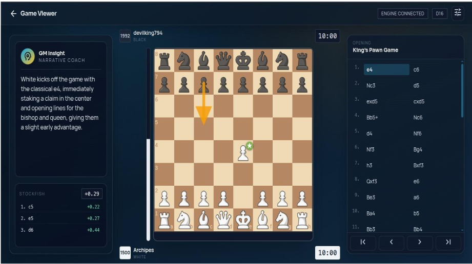
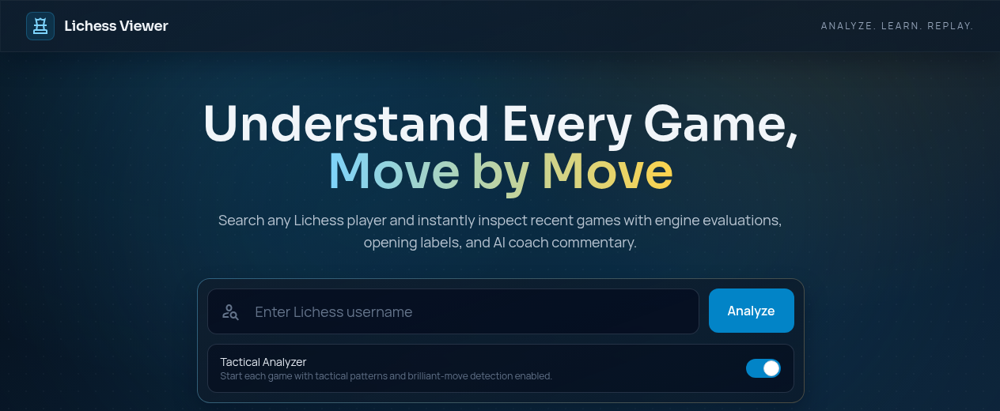
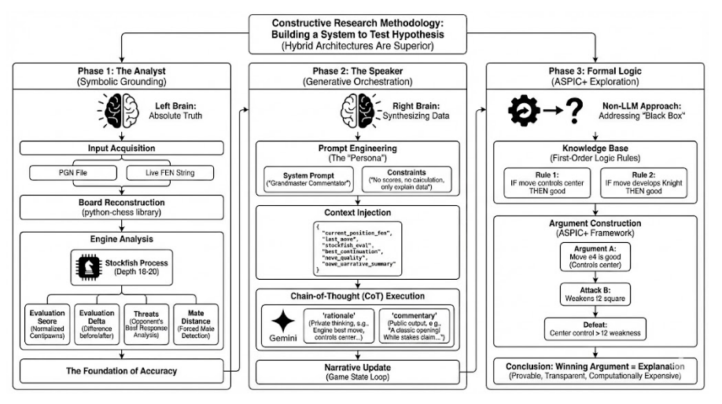

# AI Chess Commentator: Hybrid Neuro-Symbolic Engine for Real-Time Grandmaster Analysis

*Presented at the International Conference on Mathematical Sciences and Computational Intelligence (ICMSCI-2026)*

An interactive chess analysis and commentary platform that combines deterministic engine evaluations with structured natural language generation. By coupling Stockfish 16 (NNUE) with large language model orchestration, the system eliminates hallucinated moves, evaluates tactical motifs, and generates real-time, broadcast-quality grandmaster commentary.

---

## User Interfaces

### 1. Game Viewer and Real-Time Narrative Coach
The core game viewer couples legal move navigation with instant engine evaluations, move classification badges, opening recognition, and dynamic grandmaster commentary.



### 2. Player Discovery and Game Ingestion
The ingestion portal connects directly to the Lichess public API, allowing users to query any player, retrieve recent matches, and toggle the heuristic Tactical Analyzer.



---

## System Architecture and Methodology

The system is built upon a hybrid neuro-symbolic design, addressing the limitations of standalone Large Language Models (LLMs) in chess. Pure generative models frequently hallucinate illegal board positions, fail at tactical calculation, and lose contextual state over long games. Conversely, raw chess engines output numerical centipawn evaluations without pedagogical or narrative clarity. 

This platform bridges that gap across three distinct operational phases:



### Phase 1: The Analyst (Symbolic Grounding)
The deterministic foundation represents absolute truth on the board.
- **Input Acquisition:** Parses standard PGN strings or dynamic FEN inputs via the `python-chess` library.
- **Engine Processing:** Executes an asynchronous Stockfish 16 process (NNUE architecture) at depth 18–20.
- **Metric Extraction:**
  - Normalized centipawn evaluations ($cp$) and win probability projections.
  - Evaluation Delta ($\Delta \text{Eval}$): Pre-move vs. post-move evaluation shift.
  - Threat Detection: Engine-calculated opponent principal variations (PV).
  - Forced Mate Distance: Exact calculation of forced mating sequences.
- **Tactical and Positional Analyzers (`tactics_analyzer.py`):** Deterministic detection of forks, pins, skewers, discovered checks, overloaded defenders, weak square complexes, and pawn structure imbalances.

### Phase 2: The Speaker (Generative Orchestration)
The generative layer translates symbolic data into contextual narrative.
- **Context Injection:** Raw engine metrics and tactical tags are serialized into an explicit, structured telemetry payload:
  ```json
  {
    "current_position_fen": "r1bqkbnr/pppp1ppp/2n5/1B2p3/4P3/5N2/PPPP1PPP/RNBQK2R b KQkq - 3 3",
    "last_move": "Bb5",
    "stockfish_eval": "+0.29",
    "best_continuation": "a6 Ba4 Nf6",
    "move_quality": "best",
    "tactical_motifs": ["pin_on_c6", "center_control"],
    "game_narrative_summary": "White enters the Ruy Lopez, exerting indirect pressure on e5."
  }
  ```
- **System Prompt and Constraints:** The model is locked to a Grandmaster commentator persona. System constraints strictly prohibit raw calculation dumps or inventing moves; generation must strictly explain the injected telemetry.
- **Dual-Stage Chain-of-Thought (CoT):**
  - `rationale` (Private reasoning): The model verifies engine best lines and positional rationale before generating text.
  - `commentary` (Public output): Natural language broadcast commentary reflecting the emotional and strategic arc of the game.

### Phase 3: Formal Logic and Argumentation (ASPIC+ Exploration)
To explore explainable, non-black-box reasoning beyond neural generation, an experimental formal argumentation pipeline evaluates move selection:
- **First-Order Logic Knowledge Base:** Encodes classical strategic axioms (e.g., `ControlsCenter(m) -> Desirable(m)`, `WeakensKingShield(m) -> Vulnerable(m)`).
- **ASPIC+ Framework:** Constructs arguments and counter-attacks between competing candidate moves. The winning, undefeated argument serves as a verifiable and transparent explanation of positional correctness.

---

## Move Classification Engine

Moves are classified using an empirical delta scale comparing the player's move against Stockfish's top engine recommendations:

| Classification | Engine Criteria | Positional Context |
| :--- | :--- | :--- |
| **Brilliant** | Sacrificial move, $\Delta \text{Eval} \ge 0$, and unique winning line | Sound material sacrifice that unlocks decisive positional or tactical advantage. |
| **Great / Best** | Top engine recommendation ($\Delta \text{Eval} \approx 0$) | Optimal strategic continuation maintaining or expanding the advantage. |
| **Excellent / Good** | $0 < \Delta \text{Eval} \le 25\text{ cp}$ | Strong continuation with negligible loss in objective evaluation. |
| **Book** | Matches encyclopedic opening database | Established theoretical line from ECO master opening tables (`a.tsv` through `e.tsv`). |
| **Inaccuracy** | $25\text{ cp} < \Delta \text{Eval} \le 80\text{ cp}$ | Suboptimal move conceding initiative or allowing counterplay. |
| **Mistake** | $80\text{ cp} < \Delta \text{Eval} \le 200\text{ cp}$ | Significant strategic error deteriorating position balance. |
| **Miss** | Overlooked critical tactic or conversion | Failure to exploit an opponent blunder or forced winning sequence. |
| **Blunder** | $\Delta \text{Eval} > 200\text{ cp}$ or dropped mate sequence | Catastrophic tactical oversight shifting the outcome of the game. |

---

## Evaluation Framework and Benchmarks

To quantify commentary quality and factual grounding, the repository includes an automated evaluation pipeline (`evaluate_commentary.py`, `evaluate_model.py`) tested against grandmaster annotated games (`Grandmaster_Commentry.pgn`):

1. **Factual Grounding and Anti-Hallucination:**
   - Verifies all squares and piece identifiers mentioned in commentary against actual legal piece moves on the board.
   - Cross-checks claimed tactical motifs (e.g., "forks the queen and rook") against deterministic board state assertions.
2. **N-Gram Overlap Metrics:**
   - **ROUGE-L:** Evaluates longest common subsequence against verified expert game annotations.
   - **BLEU-1 / BLEU-4:** Measures lexical alignment with smoothing functions for short broadcast phrases.
3. **Semantic Alignment:**
   - Embeds generated commentary using `sentence-transformers` and computes cosine similarity against human grandmaster reference texts.

---

## Repository Structure

```text
AiChessCommentator/
├── app.py                      # Flask server, Socket.IO handlers, and route orchestration
├── commentary_logic.py         # Deterministic commentary blueprint planning and fact assembly
├── structured_commentary.py    # Structured payload serializer and prompt construction
├── semantic_commentary.py      # Natural language generation pipelines and LLM interfaces
├── tactics_analyzer.py         # Advanced tactical pattern, king safety, and threat detectors
├── evaluate_commentary.py      # Quantitative benchmark suite (BLEU, ROUGE-L, Factual Grounding)
├── evaluate_model.py           # Evaluation metric tracking and error distribution analysis
│
├── stockfish/                  # Stockfish engine binaries and compilation sources
│   ├── stockfish-ubuntu-x86-64-avx2  # Precompiled Linux binary
│   └── src/                    # Official engine source code
│
├── static/                     # Web application frontend assets
│   ├── css/app.css             # Interface styling and responsive layouts
│   ├── js/game.js              # Client board rendering, move playback, and event loop
│   ├── img/                    # SVG piece vectors and accuracy badge icons
│   └── lib/                    # Client libraries (chess.js, chessboard.js)
│
├── templates/                  # Jinja2 HTML templates
│   ├── index.html              # Search and player game discovery portal
│   └── game.html               # Main interactive analysis and commentary interface
│
├── docs/                       # Project documentation and architectural assets
│   └── images/                 # High-resolution screenshots and system diagrams
│
├── Grandmaster_Commentry.pgn   # Curated grandmaster reference corpus with human commentary
├── [a-e].tsv                   # Opening theory encyclopedia (ECO codes and standard moves)
├── requirements.txt            # Python dependencies
├── package.json                # Frontend client dependencies
└── .env                        # Local runtime configurations
```

---

## Installation and Setup

### Prerequisites
- **Python:** 3.10, 3.11, or 3.12
- **Stockfish:** Precompiled x86-64 binary provided. For other architectures, compile directly from `stockfish/src/`.
- **Node.js & npm:** (Optional, for client asset management)

### 1. Clone Repository and Create Virtual Environment
```bash
git clone https://github.com/AshutoshPapnoi794/AiChessCommentator.git
cd AiChessCommentator

python3 -m venv venv
source venv/bin/activate  # On Windows: venv\Scripts\activate
```

### 2. Install Dependencies
```bash
pip install -r requirements.txt
```

### 3. Configure Engine Permissions
Ensure the bundled Stockfish engine has execute permissions:
```bash
chmod +x stockfish/stockfish-ubuntu-x86-64-avx2
```

*(Optional)* If compiling Stockfish from source:
```bash
cd stockfish/src
make -j profile-build ARCH=x86-64-avx2
cd ../..
```

### 4. Configure Environment Variables
Create a `.env` file in the project root:
```ini
PORT=5000
DEBUG=False
STOCKFISH_PATH=stockfish/stockfish-ubuntu-x86-64-avx2
GEMINI_TEXT_API_KEY=your_gemini_api_key_here
LICHESS_TOKEN=optional_lichess_personal_token
DISABLE_KITTENTTS=1
```

---

## Running the Application

### 1. Web Application
Start the application server:
```bash
python app.py
```
Access the application at `http://localhost:5000`.

### 2. Running Evaluation Benchmarks
Execute the evaluation suite against grandmaster test datasets:
```bash
# Evaluate factual grounding and lexical quality
python evaluate_commentary.py

# Run model evaluation metrics
python evaluate_model.py
```

---

## API Reference

| Endpoint | Method | Description |
| :--- | :--- | :--- |
| `/` | `GET`, `POST` | Serves the main search portal and fetches user games via Lichess API. |
| `/game/<game_id>` | `GET` | Renders the interactive game viewer and initializes engine context. |
| `/analyze_move` | `POST` | Evaluates a single FEN transition, returning score delta, PV, and badge classification. |
| `/generate_commentary` | `POST` | Accepts a structured game telemetry payload and returns LLM-generated grandmaster commentary. |

---

## Conference Citation

If you use this codebase or methodology in academic research, please cite:

```bibtex
@inproceedings{papnoi2026hybridchess,
  title={Constructive Research Methodology: Building a Hybrid Neuro-Symbolic System for Real-Time Chess Analysis and Commentary},
  author={Papnoi, Ashutosh},
  booktitle={Proceedings of the International Conference on Mathematical Sciences and Computational Intelligence (ICMSCI-2026)},
  year={2026}
}
```

---

## License

This project utilizes open-source components. The Stockfish engine is licensed under the GNU General Public License v3.0 (GPLv3). Application logic, analysis pipelines, and evaluation modules are licensed under the MIT License.
